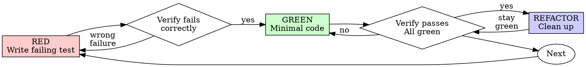

# Test-First When It Helps

## Overview

Use test-first when it materially improves confidence. Prefer the highest-level test that proves the behavior, and skip forced low-level tests for tiny mechanical changes.

**Core principle:** Reach the cheapest level of confidence that matches the risk. When test-first is the right tool, watch the test fail so you know it proves the intended behavior.

Avoid ritualized TDD. The goal is confidence and fast feedback, not ceremony.

## Repository Testing Philosophy Comes First

Before adding or changing tests, look for project rules about testing style and
quality: `AGENTS.md`, `CLAUDE.md`, `GEMINI.md`, `docs/rules/*`, testing
guides, existing nearby tests, and build/check wrappers. Those rules override
this skill.

If a behavior is worth testing, write a test that fits the project's
architecture and testing philosophy. Choose the right level for the situation:
end-to-end, integration, contract, unit, or a focused regression test. Do not
add a low-value test just to satisfy the idea of TDD.

If you cannot honestly write a project-quality test but need a temporary test
to support implementation or diagnosis, you may write one. Treat it as
scaffolding: after the implementation passes and the behavior is otherwise
verified, delete the temporary test. Do not leave bad tests in the suite.

## When to Use

**Strong fit:**
- New features with non-trivial behavior
- Bug fixes where a regression test would pin the bug down
- Behavior changes with meaningful user-visible risk
- Refactoring when tests are needed to protect the outcome

**Usually skip strict TDD:**
- Tiny mechanical edits
- Copy changes, comments, or renames
- Straightforward configuration changes
- Generated code
- Throwaway prototypes

**Testing guidance:**
- Prefer one high-level or integration-style test over many low-level tests when it covers the behavior clearly
- Add or update tests when they buy confidence; do not manufacture test churn for trivial changes
- If an existing test already covers the path, extending it can be better than writing a new micro-test
- Follow the repository's testing philosophy for test type, scope, naming, fixtures, and allowed mocks

If the change is tiny and low-risk, skipping test-first can be correct. Say that explicitly instead of pretending you are doing TDD.

## Decision Rule

```
USE TEST-FIRST WHEN IT IS THE SHORTEST PATH TO CONFIDENT FEEDBACK
```

Default test shape:
- Start with the highest-level automated test that proves the behavior
- Drop to lower-level unit tests only when that is the clearest or cheapest option
- For tiny low-risk changes, document why no new automated test is needed and validate in the lightest sensible way
- If only a temporary diagnostic test is honest, use it locally and remove it before completion

Default stance:
- Prefer one good end-to-end, integration, or workflow-level test over many implementation-shaped unit tests
- Skip new automated tests for trivial, low-risk edits when lightweight verification is enough
- Preserve backward compatibility only when there is a migration requirement or user request

## Red-Green-Refactor



### RED - Write A Failing Test

Write one minimal test showing what should happen. Prefer a user-visible or boundary-level test when practical.

<Good>
```typescript
test('retries failed operations 3 times', async () => {
  let attempts = 0;
  const operation = () => {
    attempts++;
    if (attempts < 3) throw new Error('fail');
    return 'success';
  };

  const result = await retryOperation(operation);

  expect(result).toBe('success');
  expect(attempts).toBe(3);
});
```
Clear name, tests real behavior, one thing
</Good>

<Bad>
```typescript
test('retry works', async () => {
  const mock = jest.fn()
    .mockRejectedValueOnce(new Error())
    .mockRejectedValueOnce(new Error())
    .mockResolvedValueOnce('success');
  await retryOperation(mock);
  expect(mock).toHaveBeenCalledTimes(3);
});
```
Vague name, tests mock not code
</Bad>

**Requirements:**
- One behavior
- Clear name
- Real code (no mocks unless unavoidable)

### Verify RED - Watch It Fail

**Required when using test-first.**

```bash
npm test path/to/test.test.ts
```

Confirm:
- Test fails (not errors)
- Failure message is expected
- Fails because feature missing (not typos)

**Test passes?** You're testing existing behavior. Fix test.

**Test errors?** Fix error, re-run until it fails correctly.

### GREEN - Minimal Code

Write simplest code to pass the test.

<Good>
```typescript
async function retryOperation<T>(fn: () => Promise<T>): Promise<T> {
  for (let i = 0; i < 3; i++) {
    try {
      return await fn();
    } catch (e) {
      if (i === 2) throw e;
    }
  }
  throw new Error('unreachable');
}
```
Just enough to pass
</Good>

<Bad>
```typescript
async function retryOperation<T>(
  fn: () => Promise<T>,
  options?: {
    maxRetries?: number;
    backoff?: 'linear' | 'exponential';
    onRetry?: (attempt: number) => void;
  }
): Promise<T> {
  // YAGNI
}
```
Over-engineered
</Bad>

Don't add features, refactor other code, or "improve" beyond the test.

### Verify GREEN - Watch It Pass

**Required when using test-first.**

```bash
npm test path/to/test.test.ts
```

Confirm:
- Test passes
- Other tests still pass
- Output pristine (no errors, warnings)

**Test fails?** Fix code, not test.

**Other tests fail?** Fix now.

### REFACTOR - Clean Up

After green only:
- Remove duplication
- Improve names
- Extract helpers

Keep tests green. Don't add behavior.

### Repeat

Next failing test for the next meaningful behavior, if more coverage is still needed.

## Good Tests

| Quality | Good | Bad |
|---------|------|-----|
| **Minimal** | One thing. "and" in name? Split it. | `test('validates email and domain and whitespace')` |
| **Clear** | Name describes behavior | `test('test1')` |
| **Shows intent** | Demonstrates desired API | Obscures what code should do |

## Why Order Matters

**"I'll write tests after to verify it works"**

Tests written after code often pass immediately. Passing immediately proves less:
- Might test wrong thing
- Might test implementation, not behavior
- Might miss edge cases you forgot
- You never saw it catch the bug

Test-first forces you to see the test fail, which is why it is valuable for non-trivial changes.

**"I already manually tested all the edge cases"**

Manual testing is ad-hoc. You think you tested everything but:
- No record of what you tested
- Can't re-run when code changes
- Easy to forget cases under pressure
- "It worked when I tried it" ≠ comprehensive

Automated tests are systematic. They run the same way every time.

**"TDD is dogmatic, being pragmatic means adapting"**

Good TDD is pragmatic:
- Finds bugs before commit (faster than debugging after)
- Prevents regressions (tests catch breaks immediately)
- Documents behavior (tests show how to use code)
- Enables refactoring (change freely, tests catch breaks)

Bad TDD is also real:
- Low-level tests that lock implementation instead of behavior
- Test churn on trivial changes
- Ceremony that costs more than the risk it removes

Be strict about confidence, not about ritual.

**"Tests after achieve the same goals - it's spirit not ritual"**

No. Tests-after answer "What does this do?" Tests-first answer "What should this do?"

Tests-after are biased by your implementation. You test what you built, not what's required. You verify remembered edge cases, not discovered ones.

Tests-first force edge case discovery before implementing. Tests-after verify you remembered everything (you didn't).

Tests-after can still be useful. They just are not the same as test-first.

## Pragmatic Guardrails

| Situation | Guidance |
|-----------|----------|
| "Too simple to test" | Often true. Use the lightest validation that matches the risk. |
| "I'll test after" | Fine if test-first would add ceremony and the change is straightforward. |
| "Already manually tested" | Acceptable for tiny low-risk edits; prefer automated coverage when behavior is non-trivial or likely to regress. |
| "Need to explore first" | Explore first. Use test-first only once the target behavior is clear and the feedback loop is worth it. |
| "Test hard = design unclear" | Good signal. Prefer a higher-level test or simplify the design. |
| "Existing code has no tests" | Improve coverage where it buys confidence; do not freeze progress waiting for perfect coverage. |

## Red Flags

- Choosing low-level tests that mirror implementation when one higher-level test would prove the behavior
- Adding tests mainly to satisfy process rather than reduce risk
- Claiming strong confidence without any meaningful verification
- Preserving old behavior "just in case" without a migration requirement or user request
- Treating every bugfix as a mandate to build a large new test harness
- Leaving a low-value or architecture-hostile test in the suite because it helped during implementation

These mean the testing strategy is off. Fix the strategy; do not escalate ceremony by default.

## Example: Bug Fix

**Bug:** Empty email accepted

**RED**
```typescript
test('rejects empty email', async () => {
  const result = await submitForm({ email: '' });
  expect(result.error).toBe('Email required');
});
```

**Verify RED**
```bash
$ npm test
FAIL: expected 'Email required', got undefined
```

**GREEN**
```typescript
function submitForm(data: FormData) {
  if (!data.email?.trim()) {
    return { error: 'Email required' };
  }
  // ...
}
```

**Verify GREEN**
```bash
$ npm test
PASS
```

**REFACTOR**
Extract validation for multiple fields if needed.

## Verification Checklist

Before marking work complete:

- [ ] Chosen verification matches the risk and scope of the change
- [ ] Used a high-level automated test when behavior was non-trivial and automation bought confidence
- [ ] If test-first was used, watched the test fail for the expected reason
- [ ] If no new automated test was added, recorded why lightweight verification was sufficient
- [ ] Any temporary diagnostic/scaffolding tests were removed before completion
- [ ] All relevant verification passes
- [ ] Output is clean enough to trust the result
- [ ] Tests exercise real behavior when practical
- [ ] Backward compatibility was only preserved for a migration requirement or user request

If the checklist doesn't support the current verification strategy, adjust the strategy or lower the claim.

## When Stuck

| Problem | Solution |
|---------|----------|
| Don't know how to test | Write wished-for API. Write assertion first. Ask your human partner. |
| Test too complicated | Design too complicated. Simplify interface. |
| Must mock everything | Code too coupled. Use dependency injection. |
| Test setup huge | Extract helpers. Still complex? Simplify design. |

## Debugging Integration

Bug found? Prefer a failing regression test when it is the clearest way to lock the bug down. For tiny isolated fixes, a lighter verification path can be enough if it is explicit and repeatable.

Never claim a bug is fixed without evidence.

## Testing Anti-Patterns

When adding mocks or test utilities, read @testing-anti-patterns.md to avoid common pitfalls:
- Testing mock behavior instead of real behavior
- Adding test-only methods to production classes
- Mocking without understanding dependencies

## Final Rule

```
Match verification effort to change risk.
Follow the repository's testing philosophy.
Prefer the highest-level proof.
Delete temporary low-quality tests.
Skip ceremony for tiny low-risk edits.
Default to compatibility only for migration requirements or user requests.
```

When in doubt, optimize for confidence per minute, not ritual.
